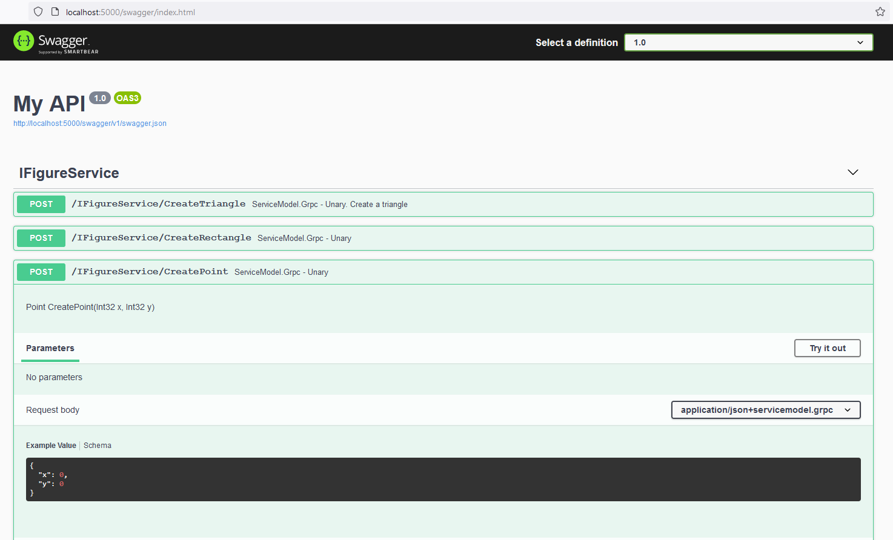

# Swagger integration example

`SwashbuckleSwagger.sln` demonstrates ServiceModel.Grpc integration with Swagger, based on [Swashbuckle.AspNetCore](https://github.com/domaindrivendev/Swashbuckle.AspNetCore).

`NSwagSwagger.sln` demonstrates ServiceModel.Grpc integration with Swagger, based on [NSwag](https://github.com/RicoSuter/NSwag).

For "Try it out" from Swagger UI ServiceModel.Grpc provides HTTP/1.1 JSON gateway.
Gateway supports only unary operations.