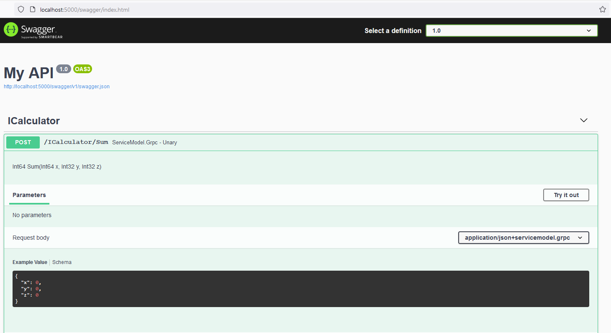

# ServiceModel.Grpc

`ServiceModel.Grpc` enables applications to communicate with gRPC services using code-first approach (no .proto files), helps to get around some limitations of gRPC protocol like "only reference types", "exact one input", "no nulls/value-types". Provides exception handling. Helps to migrate existing WCF solution to gRPC with minimum effort.

The library supports lightweight runtime proxy generation via Reflection.Emit and C# source code generation.

The solution is built on top of [gRPC C#](https://github.com/grpc/grpc/tree/master/src/csharp) and [grpc-dotnet](https://github.com/grpc/grpc-dotnet).

## Links

- [ServiceModel.Grpc at a glance](#intro)
- [NuGet feed](#nuget)
- [Benchmarks](#Benchmarks)
- [docs](https://max-ieremenko.github.io/ServiceModel.Grpc/)
  - [service and operation names](https://max-ieremenko.github.io/ServiceModel.Grpc/ServiceAndOperationName.html)
  - [service and operation bindings](https://max-ieremenko.github.io/ServiceModel.Grpc/ServiceAndOperationBinding.html)
  - [client configuration](https://max-ieremenko.github.io/ServiceModel.Grpc/ClientConfiguration.html)
  - [client code generation](https://max-ieremenko.github.io/ServiceModel.Grpc/client-code-generation.html)
  - [server code generation](https://max-ieremenko.github.io/ServiceModel.Grpc/server-code-generation.html)
  - operations
    - [unary](https://max-ieremenko.github.io/ServiceModel.Grpc/operation-unary.html)
    - [client streaming](https://max-ieremenko.github.io/ServiceModel.Grpc/operation-client-streaming.html)
    - [server streaming](https://max-ieremenko.github.io/ServiceModel.Grpc/operation-server-streaming.html)
    - [duplex streaming](https://max-ieremenko.github.io/ServiceModel.Grpc/operation-duplex-streaming.html)
  - [ASP.NET Core server configuration](https://max-ieremenko.github.io/ServiceModel.Grpc/ASPNETCoreServerConfiguration.html)
  - [Grpc.Core server configuration](https://max-ieremenko.github.io/ServiceModel.Grpc/GrpcCoreServerConfiguration.html)
  - error handler general [information](https://max-ieremenko.github.io/ServiceModel.Grpc/error-handling-general.html)
  - global error handling [tutorial](https://max-ieremenko.github.io/ServiceModel.Grpc/global-error-handling.html)
  - getting started [tutorial](https://max-ieremenko.github.io/ServiceModel.Grpc/CreateClientAndServerASPNETCore.html) create a gRPC client and server
  - [compatibility with native gRPC](https://max-ieremenko.github.io/ServiceModel.Grpc/CompatibilityWithNativegRPC.html)
  - migrate from WCF to a gRPC [tutorial](https://max-ieremenko.github.io/ServiceModel.Grpc/MigrateWCFServiceTogRPC.html)
  - migrate from WCF FaultContract to a gRPC global error handling [tutorial](https://max-ieremenko.github.io/ServiceModel.Grpc/migrate-wcf-faultcontract-to-global-error-handling.html)
  - [example](Examples/MessagePackMarshaller) MessagePack marshaller
  - [example](Examples/ProtobufMarshaller) protobuf marshaller
- [examples](Examples)

## ServiceModel.Grpc at a glance <a name="intro"></a>

### Declare a service contract

``` c#
[ServiceContract]
public interface ICalculator
{
    [OperationContract]
    Task<long> Sum(long x, int y, int z, CancellationToken token = default);

    [OperationContract]
    ValueTask<(int Multiplier, IAsyncEnumerable<int> Values)> MultiplyBy(IAsyncEnumerable<int> values, int multiplier, CancellationToken token = default);
}
```

### Client call (Reflection.Emit)

A proxy for ICalculator service will be generated on demand via `Reflection.Emit`.

```powershell
PS> Install-Package ServiceModel.Grpc
```

``` c#
// create a channel
var channel = new Channel("localhost", 5000, ...);

// create a client factory
var clientFactory = new ClientFactory();

// request the factory to generate a proxy for ICalculator service
var calculator = clientFactory.CreateClient<ICalculator>(channel);

// call Sum: sum == 6
var sum = await calculator.Sum(1, 2, 3);

// call MultiplyBy: multiplier == 2, values == [] {2, 4, 6}
var (multiplier, values) = await calculator.MultiplyBy(new[] {1, 2, 3}, 2);
```

### Client call (source code generation)

A proxy for ICalculator service will be generated in the source code.

```powershell
PS> Install-Package ServiceModel.Grpc.DesignTime
```

``` c#
// request ServiceModel.Grpc to generate a source code for ICalculator service proxy
[ImportGrpcService(typeof(ICalculator))]
internal static partial class MyGrpcServices
{
    // generated code ...
    public static IClientFactory AddCalculatorClient(this IClientFactory clientFactory, Action<ServiceModelGrpcClientOptions> configure = null) {}
}

// create a channel
var channel = new Channel("localhost", 5000, ...);

// create a client factory
var clientFactory = new ClientFactory();

// register ICalculator proxy generated by ServiceModel.Grpc.DesignTime
clientFactory.AddCalculatorClient();

// create a new instance of the proxy
var calculator = clientFactory.CreateClient<ICalculator>(channel);

// call Sum: sum == 6
var sum = await calculator.Sum(1, 2, 3);

// call MultiplyBy: multiplier == 2, values == [] {2, 4, 6}
var (multiplier, values) = await calculator.MultiplyBy(new[] {1, 2, 3}, 2);
```

> ServiceModel.Grpc.DesignTime uses roslyn [source generators](https://github.com/dotnet/roslyn/blob/master/docs/features/source-generators.md), which requires [net5.0 sdk](https://dotnet.microsoft.com/download/dotnet/5.0).

### Implement a service

``` c#
internal sealed class Calculator : ICalculator
{
    public Task<long> Sum(long x, int y, int z, CancellationToken token) => x + y + z;

    public ValueTask<(int Multiplier, IAsyncEnumerable<int> Values)> MultiplyBy(IAsyncEnumerable<int> values, int multiplier, CancellationToken token)
    {
        var multiplicationResult = DoMultiplication(values, multiplier, token);
        return new ValueTask<(int, IAsyncEnumerable<int>)>((multiplier, multiplicationResult));
    }

    private static async IAsyncEnumerable<int> DoMultiplication(IAsyncEnumerable<int> values, int multiplier, [EnumeratorCancellation] CancellationToken token)
    {
        await foreach (var value in values.WithCancellation(token))
        {
            yield return value * multiplier;
        }
    }
}
```

### Host the service in asp.net core application

```powershell
PS> Install-Package ServiceModel.Grpc.AspNetCore
```

``` c#
internal sealed class Startup
{
    public void ConfigureServices(IServiceCollection services)
    {
        // enable ServiceModel.Grpc
        services.AddServiceModelGrpc();
    }

    public void Configure(IApplicationBuilder app, IWebHostEnvironment env)
    {
        app.UseEndpoints(endpoints =>
        {
            // bind Calculator service
            endpoints.MapGrpcService<Calculator>();
        });
    }
}
```

Integrate with Swagger, see [example](Examples/Swagger)



### Host the service in Grpc.Core.Server

```powershell
PS> Install-Package ServiceModel.Grpc.SelfHost
```

``` c#
var server = new Grpc.Core.Server
{
    Ports = { new ServerPort("localhost", 5000, ...) }
};

// bind Calculator service
server.Services.AddServiceModelTransient(() => new Calculator());
```

## NuGet feed <a name="nuget"></a>

-----
Name | Package | Supported platforms | Description
-----| :------ |:------------------- | :----------
ServiceModel.Grpc | [](https://www.nuget.org/packages/ServiceModel.Grpc) | netstandard2.0/2.1, net461+ | main functionality, basic Grpc.Core.Api extensions and ClientFactory. ClientFactory is fully compatible with Grpc.Net.Client.
ServiceModel.Grpc.AspNetCore | [](https://www.nuget.org/packages/ServiceModel.Grpc.AspNetCore) | net6.0, net5.0, .net core 3.0/3.1+ | Grpc.AspNetCore.Server extensions
ServiceModel.Grpc.AspNetCore.Swashbuckle | [](https://www.nuget.org/packages/ServiceModel.Grpc.AspNetCore.Swashbuckle) | net6.0, net5.0, .net core 3.0/3.1+ | Swagger integration, based on [Swashbuckle.AspNetCore](https://github.com/domaindrivendev/Swashbuckle.AspNetCore)
ServiceModel.Grpc.AspNetCore.NSwag | [](https://www.nuget.org/packages/ServiceModel.Grpc.AspNetCore.NSwag) | net6.0, net5.0, .net core 3.0/3.1+ | Swagger integration, based on [NSwag](https://github.com/RicoSuter/NSwag)
ServiceModel.Grpc.SelfHost | [](https://www.nuget.org/packages/ServiceModel.Grpc.SelfHost) | netstandard2.0/2.1, net461+ | Grpc.Core extensions for self-hosted Grpc.Core.Server
ServiceModel.Grpc.DesignTime | [](https://www.nuget.org/packages/ServiceModel.Grpc.DesignTime) | netstandard2.0/2.1, net461+ | C# code generator
ServiceModel.Grpc.MessagePackMarshaller | [](https://www.nuget.org/packages/ServiceModel.Grpc.MessagePackMarshaller) | netstandard2.0, net6.0, net5.0, .net core 3.1 | marshaller factory, based on [MessagePack serializer](https://www.nuget.org/packages/MessagePack)
ServiceModel.Grpc.ProtoBufMarshaller | [](https://www.nuget.org/packages/ServiceModel.Grpc.ProtoBufMarshaller) | netstandard2.0/2.1, net6.0, net5.0, .net core 3.1, net461+ | marshaller factory, based on [protobuf-net serializer](https://www.nuget.org/packages/protobuf-net/)

## Benchmarks

ServiceModel.Grpc is a tiny layer on top of gRPC C# and grpc-dotnet, helps to adapt code-first to gRPC protocol. A serializer makes performance picture.

Benchmark code is available [here](/Benchmarks).

The following benchmarks show the performance for `unary call` on client and server.

``` c#
[ServiceContract]
public interface ITestService
{
    [OperationContract]
    Task<SomeObject> PingPong(SomeObject value);
}

value = new SomeObject
{
    StringScalar = "some meaningful text",
    Int32Scalar = 1,
    DateScalar = DateTime.UtcNow,
    SingleScalar = 1.1f,
    Int32Array = new int[100],
    SingleArray = new float[100],
    DoubleArray = new double[100]
};
```

- `ServiceModelGrpc.DataContract` test uses DataContractSerializer
- `ServiceModelGrpc.Protobuf` test uses protobuf-net serializer
- `ServiceModelGrpc.MessagePack` test uses MessagePack serializer
- `ServiceModelGrpc.proto-emulation` test uses Google protobuf serialization, the same as `grpc-dotnet`. This test is designed to compare numbers between `ServiceModelGrpc` and `grpc-dotnet` without influence of serializer.

- `grpc-dotnet` is a baseline:

``` proto
service TestServiceNative {
	rpc PingPong (SomeObjectProto) returns (SomeObjectProto);
}

message SomeObjectProto {
	string stringScalar = 1;
	google.protobuf.Timestamp dateScalar = 2;
	float singleScalar = 3;
	int32 int32Scalar = 4;
	repeated float singleArray = 5 [packed=true];
	repeated int32 int32Array = 6 [packed=true];
	repeated double doubleArray = 7 [packed=true];
}
```

### Client async unary call, server is stub

``` ini

BenchmarkDotNet=v0.12.1, OS=ubuntu 20.04
Intel Xeon CPU E5-2673 v3 2.40GHz, 1 CPU, 2 logical and 2 physical cores
.NET Core SDK=5.0.202
  [Host]   : .NET Core 5.0.5 (CoreCLR 5.0.521.16609, CoreFX 5.0.521.16609), X64 RyuJIT
  ShortRun : .NET Core 5.0.5 (CoreCLR 5.0.521.16609, CoreFX 5.0.521.16609), X64 RyuJIT

Job=ShortRun  Platform=X64  Force=True  
Server=False  IterationCount=15  LaunchCount=1  
RunStrategy=Throughput  WarmupCount=3  

```
|                           Method |      Mean |    Error |   StdDev |     Op/s | Ratio | RatioSD | Message size |  Gen 0 | Gen 1 | Gen 2 | Allocated |
|--------------------------------- |----------:|---------:|---------:|---------:|------:|--------:|------------- |-------:|------:|------:|----------:|
|    ServiceModelGrpc.DataContract | 259.84 μs | 8.445 μs | 7.900 μs |  3,848.5 | 15.89 |    0.60 |      6.55 KB | 3.4180 |     - |     - |  52.36 KB |
|        ServiceModelGrpc.Protobuf |  30.83 μs | 0.601 μs | 0.533 μs | 32,435.0 |  1.88 |    0.05 |      1.33 KB | 0.6409 |     - |     - |   9.99 KB |
|     ServiceModelGrpc.MessagePack |  19.77 μs | 0.151 μs | 0.126 μs | 50,592.2 |  1.21 |    0.01 |      1.52 KB | 0.6409 |     - |     - |  10.19 KB |
| ServiceModelGrpc.proto-emulation |  15.76 μs | 0.138 μs | 0.122 μs | 63,454.3 |  0.96 |    0.02 |      1.32 KB | 0.4272 |     - |     - |   6.93 KB |
|                      grpc-dotnet |  16.39 μs | 0.274 μs | 0.243 μs | 61,029.2 |  1.00 |    0.00 |      1.32 KB | 0.4272 |     - |     - |   6.88 KB |

### Server async unary call, client is stub

``` ini

BenchmarkDotNet=v0.12.1, OS=ubuntu 20.04
Intel Xeon Platinum 8171M CPU 2.60GHz, 1 CPU, 2 logical and 2 physical cores
.NET Core SDK=5.0.202
  [Host]   : .NET Core 5.0.5 (CoreCLR 5.0.521.16609, CoreFX 5.0.521.16609), X64 RyuJIT
  ShortRun : .NET Core 5.0.5 (CoreCLR 5.0.521.16609, CoreFX 5.0.521.16609), X64 RyuJIT

Job=ShortRun  Platform=X64  Force=True  
Server=False  IterationCount=15  LaunchCount=1  
RunStrategy=Throughput  WarmupCount=3  

```
|                           Method |      Mean |    Error |   StdDev |     Op/s | Ratio | RatioSD | Message size |  Gen 0 | Gen 1 | Gen 2 | Allocated |
|--------------------------------- |----------:|---------:|---------:|---------:|------:|--------:|------------- |-------:|------:|------:|----------:|
|    ServiceModelGrpc.DataContract | 328.58 μs | 3.804 μs | 3.372 μs |  3,043.4 |  5.73 |    0.14 |      6.55 KB | 3.4180 |     - |     - |  62.62 KB |
|        ServiceModelGrpc.Protobuf |  72.42 μs | 3.125 μs | 2.770 μs | 13,807.6 |  1.26 |    0.07 |      1.33 KB | 1.0986 |     - |     - |  20.14 KB |
|     ServiceModelGrpc.MessagePack |  59.08 μs | 2.240 μs | 2.096 μs | 16,925.2 |  1.02 |    0.03 |      1.52 KB | 1.0986 |     - |     - |  20.32 KB |
| ServiceModelGrpc.proto-emulation |  57.17 μs | 2.319 μs | 2.169 μs | 17,491.7 |  1.00 |    0.05 |      1.32 KB | 0.9155 |     - |     - |  17.17 KB |
|                      grpc-dotnet |  57.41 μs | 1.602 μs | 1.420 μs | 17,417.7 |  1.00 |    0.00 |      1.32 KB | 0.9155 |     - |     - |     17 KB |

### Client plus server async unary call, without stubs

``` ini

BenchmarkDotNet=v0.12.1, OS=ubuntu 20.04
Intel Xeon CPU E5-2673 v3 2.40GHz, 1 CPU, 2 logical and 2 physical cores
.NET Core SDK=5.0.202
  [Host]   : .NET Core 5.0.5 (CoreCLR 5.0.521.16609, CoreFX 5.0.521.16609), X64 RyuJIT
  ShortRun : .NET Core 5.0.5 (CoreCLR 5.0.521.16609, CoreFX 5.0.521.16609), X64 RyuJIT

Job=ShortRun  Platform=X64  Force=True  
Server=False  IterationCount=15  LaunchCount=1  
RunStrategy=Throughput  WarmupCount=3  

```
|                           Method |     Mean |    Error |   StdDev |    Op/s | Ratio | RatioSD | Message size |  Gen 0 | Gen 1 | Gen 2 | Allocated |
|--------------------------------- |---------:|---------:|---------:|--------:|------:|--------:|------------- |-------:|------:|------:|----------:|
|    ServiceModelGrpc.DataContract | 722.4 μs | 13.34 μs | 12.48 μs | 1,384.2 |  6.89 |    0.42 |      6.55 KB | 5.8594 |     - |     - | 100.16 KB |
|        ServiceModelGrpc.Protobuf | 146.9 μs |  9.43 μs |  8.82 μs | 6,806.0 |  1.40 |    0.12 |      1.33 KB | 1.7090 |     - |     - |  26.43 KB |
|     ServiceModelGrpc.MessagePack | 113.9 μs |  3.87 μs |  3.62 μs | 8,781.4 |  1.09 |    0.07 |      1.52 KB | 1.7090 |     - |     - |  26.44 KB |
| ServiceModelGrpc.proto-emulation | 102.2 μs |  2.54 μs |  2.12 μs | 9,785.7 |  0.98 |    0.07 |      1.32 KB | 1.3428 |     - |     - |  20.37 KB |
|                      grpc-dotnet | 105.2 μs |  6.16 μs |  5.76 μs | 9,508.3 |  1.00 |    0.00 |      1.32 KB | 1.2207 |     - |     - |  20.17 KB |
