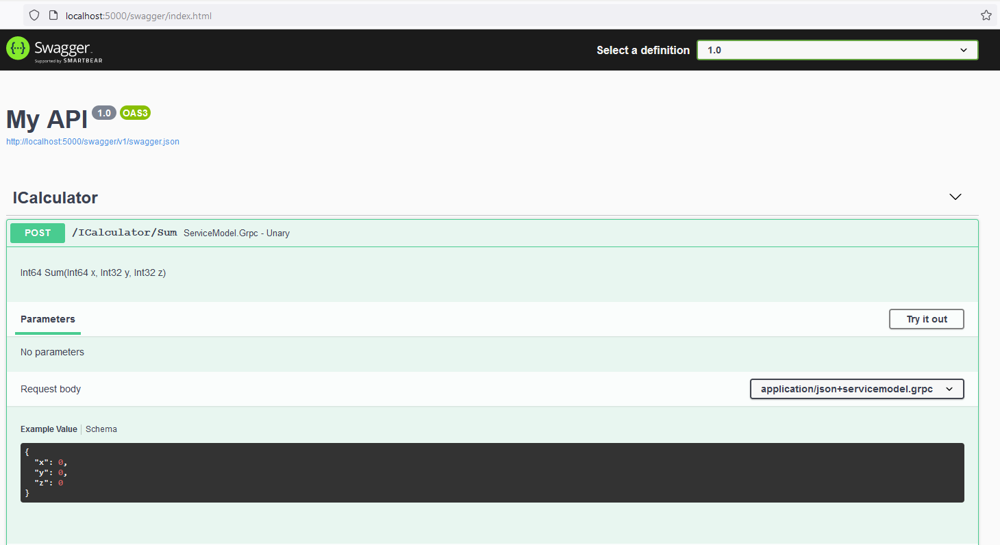

# ServiceModel.Grpc

`ServiceModel.Grpc` enables applications to communicate with gRPC services using a code-first approach (no .proto files), helps to get around limitations of gRPC protocol like "only reference types", "exact one input", "no nulls", "no value-types". Provides exception handling. Helps to migrate existing WCF solution to gRPC with minimum effort.

The library supports lightweight runtime proxy generation via Reflection.Emit and C# source code generation.

The solution is built on top of [gRPC C#](https://github.com/grpc/grpc/tree/master/src/csharp) and [grpc-dotnet](https://github.com/grpc/grpc-dotnet).

## Links

- [ServiceModel.Grpc at a glance](#intro)
- [NuGet feed](#nuget)
- [Benchmarks](#Benchmarks)
- [docs](https://max-ieremenko.github.io/ServiceModel.Grpc/)
  - [service and operation names](https://max-ieremenko.github.io/ServiceModel.Grpc/ServiceAndOperationName.html)
  - [service and operation bindings](https://max-ieremenko.github.io/ServiceModel.Grpc/ServiceAndOperationBinding.html)
  - [client configuration](https://max-ieremenko.github.io/ServiceModel.Grpc/ClientConfiguration.html)
  - [client code generation](https://max-ieremenko.github.io/ServiceModel.Grpc/client-code-generation.html)
  - [client dependency injection](https://max-ieremenko.github.io/ServiceModel.Grpc/client-dependency-injection.html)
  - [server code generation](https://max-ieremenko.github.io/ServiceModel.Grpc/server-code-generation.html)
  - operations
    - [unary](https://max-ieremenko.github.io/ServiceModel.Grpc/operation-unary.html)
    - [client streaming](https://max-ieremenko.github.io/ServiceModel.Grpc/operation-client-streaming.html)
    - [server streaming](https://max-ieremenko.github.io/ServiceModel.Grpc/operation-server-streaming.html)
    - [duplex streaming](https://max-ieremenko.github.io/ServiceModel.Grpc/operation-duplex-streaming.html)
  - [ASP.NET Core server configuration](https://max-ieremenko.github.io/ServiceModel.Grpc/ASPNETCoreServerConfiguration.html)
  - [Grpc.Core server configuration](https://max-ieremenko.github.io/ServiceModel.Grpc/GrpcCoreServerConfiguration.html)
  - [exception handling general information](https://max-ieremenko.github.io/ServiceModel.Grpc/error-handling-general.html)
  - [global exception handling](https://max-ieremenko.github.io/ServiceModel.Grpc/global-error-handling.html)
  - [client filters](https://max-ieremenko.github.io/ServiceModel.Grpc/client-filters.html)
  - [server filters](https://max-ieremenko.github.io/ServiceModel.Grpc/server-filters.html)
  - [compatibility with native gRPC](https://max-ieremenko.github.io/ServiceModel.Grpc/CompatibilityWithNativegRPC.html)
  - [migrate from WCF to a gRPC](https://max-ieremenko.github.io/ServiceModel.Grpc/MigrateWCFServiceTogRPC.html)
  - [migrate from WCF FaultContract to a gRPC global error handling](https://max-ieremenko.github.io/ServiceModel.Grpc/migrate-wcf-faultcontract-to-global-error-handling.html)
- [examples](Examples)

## ServiceModel.Grpc at a glance <a name="intro"></a>

### Declare a service contract

``` c#
[ServiceContract]
public interface ICalculator
{
    [OperationContract]
    Task<long> Sum(long x, int y, int z, CancellationToken token = default);

    [OperationContract]
    ValueTask<(int Multiplier, IAsyncEnumerable<int> Values)> MultiplyBy(IAsyncEnumerable<int> values, int multiplier, CancellationToken token = default);
}
```

### Client call (Reflection.Emit)

A proxy for the ICalculator service will be generated on demand via `Reflection.Emit`.

```powershell
PS> Install-Package ServiceModel.Grpc
```

``` c#
// create a channel
var channel = new Channel("localhost", 5000, ...);

// create a client factory
var clientFactory = new ClientFactory();

// request the factory to generate a proxy for ICalculator service
var calculator = clientFactory.CreateClient<ICalculator>(channel);

// call Sum: sum == 6
var sum = await calculator.Sum(1, 2, 3);

// call MultiplyBy: multiplier == 2, values == [] {2, 4, 6}
var (multiplier, values) = await calculator.MultiplyBy(new[] {1, 2, 3}, 2);
```

### Client call (source code generation)

A proxy for the ICalculator service will be generated in the source code.

```powershell
PS> Install-Package ServiceModel.Grpc.DesignTime
```

``` c#
// request ServiceModel.Grpc to generate a source code for ICalculator service proxy
[ImportGrpcService(typeof(ICalculator))]
internal static partial class MyGrpcServices
{
    // generated code ...
    public static IClientFactory AddCalculatorClient(this IClientFactory clientFactory, Action<ServiceModelGrpcClientOptions> configure = null) {}
}

// create a channel
var channel = new Channel("localhost", 5000, ...);

// create a client factory
var clientFactory = new ClientFactory();

// register ICalculator proxy generated by ServiceModel.Grpc.DesignTime
clientFactory.AddCalculatorClient();

// create a new instance of the proxy
var calculator = clientFactory.CreateClient<ICalculator>(channel);

// call Sum: sum == 6
var sum = await calculator.Sum(1, 2, 3);

// call MultiplyBy: multiplier == 2, values == [] {2, 4, 6}
var (multiplier, values) = await calculator.MultiplyBy(new[] {1, 2, 3}, 2);
```

### Implement a service

``` c#
internal sealed class Calculator : ICalculator
{
    public Task<long> Sum(long x, int y, int z, CancellationToken token) => x + y + z;

    public ValueTask<(int Multiplier, IAsyncEnumerable<int> Values)> MultiplyBy(IAsyncEnumerable<int> values, int multiplier, CancellationToken token)
    {
        var multiplicationResult = DoMultiplication(values, multiplier, token);
        return new ValueTask<(int, IAsyncEnumerable<int>)>((multiplier, multiplicationResult));
    }

    private static async IAsyncEnumerable<int> DoMultiplication(IAsyncEnumerable<int> values, int multiplier, [EnumeratorCancellation] CancellationToken token)
    {
        await foreach (var value in values.WithCancellation(token))
        {
            yield return value * multiplier;
        }
    }
}
```

### Host the service in the asp.net core application

```powershell
PS> Install-Package ServiceModel.Grpc.AspNetCore
```

``` c#
var builder = WebApplication.CreateBuilder();

// enable ServiceModel.Grpc
builder.Services.AddServiceModelGrpc();

var app = builder.Build();

// bind Calculator service
app.MapGrpcService<Calculator>();
```

Integrate with Swagger, see [example](Examples/Swagger)



### Host the service in Grpc.Core.Server

```powershell
PS> Install-Package ServiceModel.Grpc.SelfHost
```

``` c#
var server = new Grpc.Core.Server
{
    Ports = { new ServerPort("localhost", 5000, ...) }
};

// bind Calculator service
server.Services.AddServiceModelTransient(() => new Calculator());
```

### Server filters

see [example](Examples/ServerFilters)

``` c#
var builder = WebApplication.CreateBuilder();

// setup filter life time
builder.Services.AddSingleton<LoggingServerFilter>();

// attach the filter globally
builder.Services.AddServiceModelGrpc(options =>
{
	options.Filters.Add(1, provider => provider.GetRequiredService<LoggingServerFilter>());
});

internal sealed class LoggingServerFilter : IServerFilter
{
    private readonly ILoggerFactory _loggerFactory;

    public LoggingServerFilter(ILoggerFactory loggerFactory)
    {
        _loggerFactory = loggerFactory;
    }

    public async ValueTask InvokeAsync(IServerFilterContext context, Func<ValueTask> next)
    {
        // create logger with a service name
        var logger = _loggerFactory.CreateLogger(context.ServiceInstance.GetType().Name);

        // log input
        logger.LogInformation("begin {0}", context.ContractMethodInfo.Name);
        foreach (var entry in context.Request)
        {
            logger.LogInformation("input {0} = {1}", entry.Key, entry.Value);
        }

        try
        {
            // invoke all other filters in the stack and the service method
            await next().ConfigureAwait(false);
        }
        catch (Exception ex)
        {
            // log exception
            logger.LogError("error {0}: {1}", context.ContractMethodInfo.Name, ex);
            throw;
        }

        // log output
        logger.LogInformation("end {0}", context.ContractMethodInfo.Name);
        foreach (var entry in context.Response)
        {
            logger.LogInformation("output {0} = {1}", entry.Key, entry.Value);
        }
    }
}
```

## NuGet feed <a name="nuget"></a>

Name | Package | Description
-----| :------ | :----------
ServiceModel.Grpc | [](https://www.nuget.org/packages/ServiceModel.Grpc) | main functionality, basic Grpc.Core.Api extensions and ClientFactory. ClientFactory is fully compatible with Grpc.Net.Client.
ServiceModel.Grpc.Client.DependencyInjection | [](https://www.nuget.org/packages/ServiceModel.Grpc.Client.DependencyInjection) | Dependency injection extensions for ClientFactory and Grpc.Net.ClientFactory
ServiceModel.Grpc.AspNetCore | [](https://www.nuget.org/packages/ServiceModel.Grpc.AspNetCore) | Grpc.AspNetCore.Server extensions
ServiceModel.Grpc.AspNetCore.Swashbuckle | [](https://www.nuget.org/packages/ServiceModel.Grpc.AspNetCore.Swashbuckle) | Swagger integration, based on [Swashbuckle.AspNetCore](https://github.com/domaindrivendev/Swashbuckle.AspNetCore)
ServiceModel.Grpc.AspNetCore.NSwag | [](https://www.nuget.org/packages/ServiceModel.Grpc.AspNetCore.NSwag) | Swagger integration, based on [NSwag](https://github.com/RicoSuter/NSwag)
ServiceModel.Grpc.SelfHost | [](https://www.nuget.org/packages/ServiceModel.Grpc.SelfHost) | Grpc.Core extensions for self-hosted Grpc.Core.Server
ServiceModel.Grpc.DesignTime | [](https://www.nuget.org/packages/ServiceModel.Grpc.DesignTime) | C# code generator
ServiceModel.Grpc.MessagePackMarshaller | [](https://www.nuget.org/packages/ServiceModel.Grpc.MessagePackMarshaller) | marshaller factory, based on [MessagePack serializer](https://www.nuget.org/packages/MessagePack)
ServiceModel.Grpc.ProtoBufMarshaller | [](https://www.nuget.org/packages/ServiceModel.Grpc.ProtoBufMarshaller) | marshaller factory, based on [protobuf-net serializer](https://www.nuget.org/packages/protobuf-net/)
ServiceModel.Grpc.MemoryPackMarshaller | [](https://www.nuget.org/packages/ServiceModel.Grpc.MemoryPackMarshaller) | marshaller factory, based on [MemoryPack serializer](https://www.nuget.org/packages/MemoryPack)
ServiceModel.Grpc.Nerdbank.MessagePackMarshaller | [](https://www.nuget.org/packages/ServiceModel.Grpc.Nerdbank.MessagePackMarshaller) | marshaller factory, based on [Nerdbank.MessagePack serializer](https://www.nuget.org/packages/Nerdbank.MessagePack)

## Benchmarks

ServiceModel.Grpc is a tiny layer on top of grpc-dotnet, which helps to adapt code-first to gRPC protocol. A serializer makes a picture of the performance.

Benchmark code is available [here](/Benchmarks).

The following benchmarks show the performance for `unary call` on client and server.

``` c#
[ServiceContract]
public interface ITestService
{
    [OperationContract]
    Task<SomeObject> PingPong(SomeObject value);
}

value = new SomeObject
{
    StringScalar = "some meaningful text",
    Int32Scalar = 1,
    DateScalar = DateTime.UtcNow,
    SingleScalar = 1.1f,
    Int32Array = new int[100],
    SingleArray = new float[100],
    DoubleArray = new double[100]
};
```

- `ServiceModelGrpc.DataContract` test uses DataContractSerializer
- `ServiceModelGrpc.Protobuf` test uses protobuf-net serializer
- `ServiceModelGrpc.MessagePack` test uses MessagePack serializer
- `ServiceModelGrpc.proto-emulation` test uses Google protobuf serialization, the same as `grpc-dotnet`. This test is designed to compare numbers between `ServiceModelGrpc` and `grpc-dotnet` without the influence of a serializer.

- `grpc-dotnet` is a baseline:

``` proto
service TestServiceNative {
	rpc PingPong (SomeObjectProto) returns (SomeObjectProto);
}

message SomeObjectProto {
	string stringScalar = 1;
	google.protobuf.Timestamp dateScalar = 2;
	float singleScalar = 3;
	int32 int32Scalar = 4;
	repeated float singleArray = 5 [packed=true];
	repeated int32 int32Array = 6 [packed=true];
	repeated double doubleArray = 7 [packed=true];
}
```

### Client async unary call, server is stub

```
BenchmarkDotNet v0.15.8, Linux Ubuntu 24.04.3 LTS (Noble Numbat)
AMD EPYC 7763 2.45GHz, 1 CPU, 4 logical and 2 physical cores
.NET SDK 10.0.101
  [Host]   : .NET 10.0.1 (10.0.1, 10.0.125.57005), X64 RyuJIT x86-64-v3
  ShortRun : .NET 10.0.1 (10.0.1, 10.0.125.57005), X64 RyuJIT x86-64-v3

Job=ShortRun  Platform=X64  Force=True  
Server=False  IterationCount=15  LaunchCount=1  
RunStrategy=Throughput  WarmupCount=3  

```
| Method                           | Mean       | Error      | StdDev    | Ratio | RatioSD | Gen0   | Gen1   | Allocated | Alloc Ratio |
|--------------------------------- |-----------:|-----------:|----------:|------:|--------:|-------:|-------:|----------:|------------:|
| ServiceModelGrpc.DataContract    | 119.129 μs | 10.1822 μs | 8.5026 μs | 28.00 |    1.94 | 2.9297 |      - |  51.39 KB |        7.75 |
| ServiceModelGrpc.Protobuf        |  10.489 μs |  0.0917 μs | 0.0813 μs |  2.47 |    0.03 | 0.5493 |      - |   9.02 KB |        1.36 |
| ServiceModelGrpc.MessagePack     |   5.306 μs |  0.0643 μs | 0.0601 μs |  1.25 |    0.02 | 0.7019 | 0.0153 |  11.55 KB |        1.74 |
| ServiceModelGrpc.MemoryPack      |   3.315 μs |  0.0646 μs | 0.0604 μs |  0.78 |    0.02 | 0.6790 | 0.0153 |  11.13 KB |        1.68 |
| grpc-dotnet                      |   4.254 μs |  0.0447 μs | 0.0418 μs |  1.00 |    0.01 | 0.4044 | 0.0076 |   6.63 KB |        1.00 |
| ServiceModelGrpc.proto-emulation |   4.629 μs |  0.1077 μs | 0.1007 μs |  1.09 |    0.03 | 0.4120 | 0.0076 |   6.76 KB |        1.02 |

### Server async unary call, client is stub

```

BenchmarkDotNet v0.15.8, Linux Ubuntu 24.04.3 LTS (Noble Numbat)
AMD EPYC 7763 2.45GHz, 1 CPU, 4 logical and 2 physical cores
.NET SDK 10.0.101
  [Host]   : .NET 10.0.1 (10.0.1, 10.0.125.57005), X64 RyuJIT x86-64-v3
  ShortRun : .NET 10.0.1 (10.0.1, 10.0.125.57005), X64 RyuJIT x86-64-v3

Job=ShortRun  Platform=X64  Force=True  
Server=False  IterationCount=15  LaunchCount=1  
RunStrategy=Throughput  WarmupCount=3  

```
| Method                           | Mean      | Error     | StdDev    | Median    | Ratio | RatioSD | Gen0   | Allocated | Alloc Ratio |
|--------------------------------- |----------:|----------:|----------:|----------:|------:|--------:|-------:|----------:|------------:|
| ServiceModelGrpc.DataContract    | 210.35 μs | 41.818 μs | 37.071 μs | 199.85 μs |  7.07 |    2.51 | 2.9297 |  60.47 KB |        3.92 |
| ServiceModelGrpc.Protobuf        |  50.70 μs |  1.047 μs |  0.817 μs |  50.69 μs |  1.70 |    0.52 | 0.9766 |  17.82 KB |        1.16 |
| ServiceModelGrpc.MessagePack     |  33.08 μs |  4.812 μs |  3.757 μs |  32.12 μs |  1.11 |    0.36 | 1.2207 |  20.32 KB |        1.32 |
| ServiceModelGrpc.MemoryPack      |  34.96 μs | 17.439 μs | 15.459 μs |  27.94 μs |  1.17 |    0.64 | 1.2207 |   19.9 KB |        1.29 |
| grpc-dotnet                      |  34.00 μs | 16.692 μs | 14.797 μs |  25.67 μs |  1.14 |    0.61 | 0.7324 |  15.42 KB |        1.00 |
| ServiceModelGrpc.proto-emulation |  30.96 μs |  8.989 μs |  7.018 μs |  30.52 μs |  1.04 |    0.40 | 0.7324 |   15.6 KB |        1.01 |

### Client plus server async unary call, without stubs

```

BenchmarkDotNet v0.15.8, Linux Ubuntu 24.04.3 LTS (Noble Numbat)
AMD EPYC 7763 2.45GHz, 1 CPU, 4 logical and 2 physical cores
.NET SDK 10.0.101
  [Host]   : .NET 10.0.1 (10.0.1, 10.0.125.57005), X64 RyuJIT x86-64-v3
  ShortRun : .NET 10.0.1 (10.0.1, 10.0.125.57005), X64 RyuJIT x86-64-v3

Job=ShortRun  Platform=X64  Force=True  
Server=False  IterationCount=15  LaunchCount=1  
RunStrategy=Throughput  WarmupCount=3  

```
| Method                           | Mean      | Error     | StdDev    | Median    | Ratio | RatioSD | Gen0   | Allocated | Alloc Ratio |
|--------------------------------- |----------:|----------:|----------:|----------:|------:|--------:|-------:|----------:|------------:|
| ServiceModelGrpc.DataContract    | 347.73 μs | 74.072 μs | 65.663 μs | 323.57 μs |  5.79 |    2.63 | 5.8594 |   98.2 KB |        5.20 |
| ServiceModelGrpc.Protobuf        |  95.14 μs | 32.059 μs | 28.419 μs |  78.86 μs |  1.59 |    0.81 | 1.4648 |  23.64 KB |        1.25 |
| ServiceModelGrpc.MessagePack     |  46.98 μs |  2.294 μs |  1.916 μs |  47.53 μs |  0.78 |    0.32 | 1.7090 |   28.3 KB |        1.50 |
| ServiceModelGrpc.MemoryPack      |  32.99 μs |  3.622 μs |  2.828 μs |  31.31 μs |  0.55 |    0.23 | 1.7090 |  27.23 KB |        1.44 |
| grpc-dotnet                      |  74.24 μs | 40.437 μs | 37.825 μs |  52.25 μs |  1.24 |    0.83 | 0.9766 |  18.87 KB |        1.00 |
| ServiceModelGrpc.proto-emulation |  41.47 μs |  3.090 μs |  2.580 μs |  40.35 μs |  0.69 |    0.29 | 0.9766 |  19.14 KB |        1.01 |
